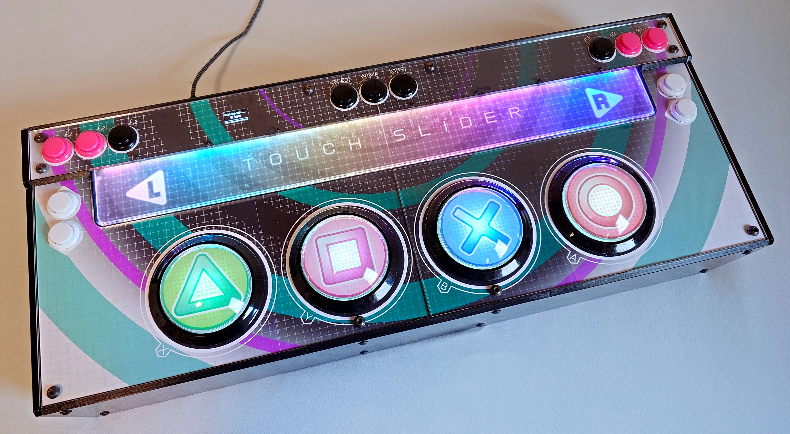
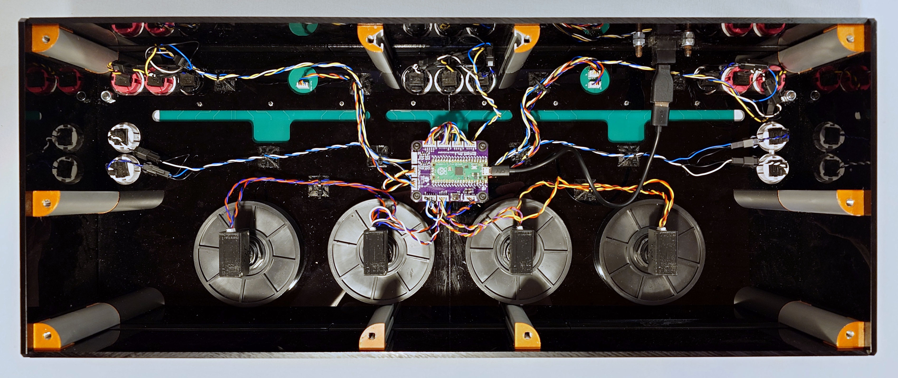

# DivaCon2040 - Firmware for RP2040 based Project Diva controllers

DivaCon2040 is a firmware for DIY Project Diva Arcade controllers based on the RP2040 microcontroller as found on the Raspberry Pi Pico.

It is pretty much tailored to this specific use case, if you are looking for something universal, ready-to-flash and on-the-fly configurable I'd recommend to have a look at more generic approaches like [GP2040-CE](https://github.com/OpenStickCommunity/GP2040-CE). If you however want build something more specialized or custom, feel free to use this project as a base, it is designed to be somewhat modular and should be easy remodel. See [DonCon2040](https://github.com/ravinrabbid/DonCon2040) for an example on how this could look like.

If you have any questions about the project in general or need hints how to build this thing, feel free to open a [discussion](https://github.com/ravinrabbid/DivaCon2040/discussions) anytime!



## Features

- Various controller emulation modes
  - HORI PS4-161 Project Diva Arcade Controller
  - HORI NSW-230 Project Diva Arcade Controller
  - PD-Loader Arcade Controller (Compatible with [PD-Loader](https://github.com/PDModdingCommunity/PD-Loader/)'s Divaller driver)
  - PS4 Compatibility (will work on PS4, but will timeout after ~8 minutes)
  - Dualshock 4 (Only for PC/Steam, does not work on an actual PS4!)
  - Dualshock 3
  - Switch Pro Controller
  - XInput
  - Keyboard
  - MIDI
  - Debug mode (will output current state via USB serial and allow direct flashing)
- Arcade Style Touch Slider for arcade controller emulation modes (In Project Diva Games with arcade controller support: Enter the 'Customize' menu from song selection and enable arcade controller support under 'Game/Control Config' -> 'Arcade Controller Settings' for the slider to work properly.)
- Slider to analog stick mapping for standard controller modes
- Option to mirror face buttons to directional pad for games with 'W'-arrows
- 1000Hz Polling Rate, ~2.4ms average latency, <0.7ms Jitter (Tested with [Gamepadla](https://github.com/cakama3a/Gamepadla)/[GPDL](https://github.com/cakama3a/GPDL/))
- Slider illumination using WS2812 LED strip (can be controlled by PD-Loader)
- Button illumination (can be controlled by PD-Loader)
- Basic configuration via on-screen menu on attached OLED screen
- BPM counter

## Game Compatibility

| Title                                                                       | Platform | Official Arcade Slider Support |      Recommended Mode      | Notes                                                                                                                                                                                                                                                                                                                                                |
| --------------------------------------------------------------------------- | :------: | :----------------------------: | :------------------------: | :--------------------------------------------------------------------------------------------------------------------------------------------------------------------------------------------------------------------------------------------------------------------------------------------------------------------------------------------------- |
| Hatsune Miku -Project DIVA- Dreamy Theater                                  |   PS3    |               No               | Dualshock 3 + 'Double Btn' | - **Untested** but will likely work.<br>- Slider can be used for Star notes.<br>- Enable 'Double Btn' to make hitting 'W'-arrows easier.                                                                                                                                                                                                             |
| Hatsune Miku -Project DIVA- Dreamy Theater 2nd                              |   PS3    |               No               | Dualshock 3 + 'Double Btn' | - Slider can be used for Star notes.<br>- Enable 'Double Btn' to make hitting 'W'-arrows easier.                                                                                                                                                                                                                                                     |
| Hatsune Miku -Project DIVA- Dreamy Theater extend                           |   PS3    |               No               | Dualshock 3 + 'Double Btn' | - **Untested** but will likely work.<br>- Slider can be used for Star notes.<br>- Enable 'Double Btn' to make hitting 'W'-arrows easier.                                                                                                                                                                                                             |
| Hatsune Miku -Project DIVA- F                                               |   PS3    |               No               | Dualshock 3 + 'Double Btn' | - Slider can be used for Star notes.<br>- Enable 'Double Btn' to make hitting 'W'-arrows easier.                                                                                                                                                                                                                                                     |
| Hatsune Miku -Project DIVA- F2nd                                            |   PS3    |               No               | Dualshock 3 + 'Double Btn' | - Slider can be used for Star notes.<br>- Enable 'Double Btn' to make hitting 'W'-arrows easier.                                                                                                                                                                                                                                                     |
| Hatsune Miku -Project DIVA- Future Tone                                     |   PS4    |               No               |         PS4 Compat         | - Controller will time timeout after ~8 minutes. Replug before each song.<br>- Game does not support arcade style slider, stick emulation will be used.                                                                                                                                                                                              |
| Hatsune Miku -Project DIVA- Future Tone DX                                  |   PS4    |              Yes               |          PS4 Diva          | - Controller will time timeout after ~8 minutes. Replug before each song.<br>- From song selection enter the 'Customize' menu and enable arcade controller support under 'Game/Control Config' -> 'Arcade Controller Settings'.                                                                                                                      |
| Hatsune Miku -Project DIVA- X                                               |   PS4    |               No               | PS4 Compat + 'Double Btn'  | - Controller will time timeout after ~8 minutes. Replug before each song.<br>- Slider can be used for Star notes.<br>- Enable 'Double Btn' to make hitting 'W'-arrows easier.                                                                                                                                                                        |
| Hatsune Miku: Project DIVA Mega Mix / Hatsune Miku -Project DIVA- MEGA39’s  |  Switch  |              Yes               |        Switch Diva         | - When starting the game, choose 'Arcade Mode'.<br> - From song selection enter the 'Customize' menu and enable arcade controller support under 'Game/Control Config' -> 'Arcade Controller Settings'.                                                                                                                                               |
| Hatsune Miku -Project DIVA- Arcade Future Tone (PDLoader)                   |    PC    |              Yes               |         PDL Arcade         | - Should work out-of-the-box. (You might need to enable `slider_in_menus` in `keyconfig.ini` and `Hardware_Slider` in `config.ini`).<br>- 'PS4 Diva' also works, see [here](https://github.com/PDModdingCommunity/PD-Loader/wiki/3%29-Usage,-Modules-%28Costumes%29,-Troubleshooting#official-hori-ps4-ft-controller-with-slider) for configuration. |
| Hatsune Miku: Project DIVA Mega 39s+ / Hatsune Miku: Project DIVA Mega Mix+ |    PC    |              Yes               |  PS4 Diva or Switch Diva   | - From song selection enter the 'Customize' menu and enable arcade controller support under 'Game/Control Config' -> 'Arcade Controller Settings'.                                                                                                                                                                                                   |


## Building

I highly recommend to build the firmware yourself so you can make adjustments in `include/GlobalConfiguration.h` to match your specific controller build.
If you still want to use a [binary release](https://github.com/ravinrabbid/DivaCon2040/releases), you need to connect everything according the default configuration as described [here](SCHEMATIC.md).

### VSCode (Windows, Linux, MacOS)

Install [VSCode](https://code.visualstudio.com/) and get the [Raspberry Pi Pico](https://marketplace.visualstudio.com/items?itemName=raspberry-pi.raspberry-pi-pico) extension. From the extension choose 'Import Project' and select the folder where you've checked out this repository, then use 'Compile Project'.

### CLI

See [pico-sdk readme](https://github.com/raspberrypi/pico-sdk/blob/master/README.md#quick-start-your-own-project) for a list of pre-requisites.

Use the environment variables `PICO_SDK_PATH` to use a local pico-sdk, and `PICO_BOARD` to select another target board.
By default the pico-sdk will be fetched from Github and the target board will be "pico".

```sh
mkdir build && cd build
cmake ..
make
```

## Configuration

Options which you probably want to change more regularly can be changed using the on-screen menu on the attached OLED display, hold both Start and Select for 2 seconds to enter it:

- Controller emulation mode
- Touch Slider LED mode, color and brightness
- Face button to directional pad mirroring
- Reset settings to defaults
- Enter BOOTSEL mode for firmware flashing

Those settings are persisted to flash memory if you choose 'Save' when exiting the Menu and will survive power cycles.

Everything else is compiled statically into the firmware. You can find defaults and hardware configuration in `include/GlobalConfiguration.h`. This covers default controller emulation mode, button pins, i2c pins, addresses and speed, LED colors and brightness.

## Hardware

This project was designed and tested on the Raspberry Pi Pico. Other RP2040 boards are probably also working if they expose enough GPIOs.

For an overview how everything is connected in the default configuration, [see here](SCHEMATIC.md).

### Buttons

Buttons are hooked up directly to the GPIO pins, pulling the pin to ground when pressed.

Supported are:

- Four face buttons, which are mapped according to the cardinal directions they appear on the respective controllers (North/East/South/West)
- DPad/Hat (Up/Down/Left/Right)
- Two shoulder buttons for each side (L1/L2/R1/R2)
- Two Stick buttons (L3/R3)
- Three vendor specific buttons (Options/TouchPad/PS on DS4, Start/Select/PS on DS3, +/-/Home on Switch, Start/Back/Guide on XInput)

For the four big buttons I used generic 100mm "Massive Arcade Button"s since those are much cheaper than the original Sanwa OBSA-100UMQ.
They have same size an can be easily improved with the original OBSA-SP-200 200g springs and better switches, like the ridiculously expensive Sanwa OBSA-LHSXF or [steelpuxnastik's excellent DIY switches](https://github.com/steelpuxnastik/SHINSANWASWITCH) for a more authentic feel.

The other buttons are cheap generic 24mm arcade buttons.

### Button LEDs

Illumination for the four face buttons can be controlled by GPIO pins. I recommend to not directly hook up the LEDs to the GPIO pins, but rather use a simple transistor based driving circuit since the power than can be delivered through the GPIOs is rather limited.

### Touch Slider

The touch slider resembles the the slider of Project Diva Arcade Controllers and Cabinets, being a row of 32 individual touch sensors. For the two arcade controller emulation modes, the 32 sensors are mapped to the analog stick axes as described [here](https://gist.github.com/dogtopus/48ad10409aa4ad5c408e31287623e167) and work just like the original controllers in-game. In Project Diva games which support arcade controllers (i.e. Mega Mix on PC/Switch), enter the 'Customize' menu from song selection and enable arcade controller support under 'Game/Control Config' -> 'Arcade Controller Settings' for the slider to work properly.

For other controller emulation modes, swipes on the left half of the slider will move the left stick left and right, while swipes on the right half will do the same on the right stick.

The Touch Slider is based on three MPR121 Capacitive Touch Sensor Controllers attached to the same i2c bus, so make sure to have them use different i2c addresses accordingly. I screwed up hooking up the electrodes a little, so either refer to the table below or do it properly and change it in the code:

|               | **MPR 0** | **MPR 1** | **MPR 2** |
| ------------- | :-------: | :-------: | :-------: |
| **Pin**       |   0..11   |   2..9    |   0..11   |
| **Electrode** |  31..20   |  19..12   |   11..0   |

The MPR121s are setup for auto configuration with parameters taken from the [Adafruit MPR121 Arduino Library](https://github.com/adafruit/Adafruit_MPR121). The 'FDL falling' value has been tweaked to allow slow slides. You might want to adjust the touch and release thresholds to your specific build.

Physically, the slider is a sandwich made out of 3mm of frosted acrylic, some thin 3M 468MP adhesive, paper for the artwork and 32 strips of 5mm wide copper tape for the electrodes. Make sure to use the thinnest possible wire to connect the electrodes to the MPR121 boards.

For illumination, I used [Adafruit Side Light NeoPixel LED PCB Bars](https://www.adafruit.com/product/3729) which have the perfect hight and spacing to light up each segment with two LEDs, but other WS2812 compatible strips should work as well.

### OLED Display

Just a standard SSD1306 OLED display with 128x64 resolution hooked up to the second i2c bus. Mind that the display is mandatory for changing any settings directly on the controller, if you want to omit it, change the defaults within the code accordingly (or navigate the menu blindly).

### The 'Box'

The enclosure is build with lasercut 5mm opaque balck acrylic panels held together by aluminum profiles and some 3D printed spacers.
Edges and the cradles the touch slider sits in are also 3D printed. The Artwork is sandwiched behind an additional layer of 4mm transparent acrylic.



## Acknowledgements

- Adafruit for the figuring out some working [MPR121 settings](https://github.com/adafruit/Adafruit_MPR121)
- [daschr](https://github.com/daschr) for the [SSD1306 OLED driver](https://github.com/daschr/pico-ssd1306)
- [FeralAI](https://github.com/FeralAI) for the inspiration and Dualshock3/XInput driver from the [GP2040 Project](https://github.com/FeralAI/GP2040)
- [dogtopus](https://github.com/dogtopus) for his research on the arcade slider and various contributions to many controller related projects
- [steelpuxnastik](https://github.com/steelpuxnastik) for the excellent [SHINSANWASWITCH](https://github.com/steelpuxnastik/SHINSANWASWITCH)
- The linux kernel contributors for documenting the game controllers in their drivers
