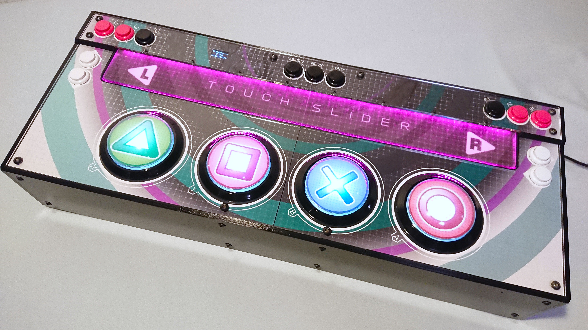

# DivaCon2040 - Firmware for RP2040 based Project Diva controllers

DivaCon2040 is a firmware for DIY Project Diva Arcade controllers based on the RP2040 microcontroller as found on the Raspberry Pi Pico.

It is pretty much tailored to this specific use case, if you are looking for something universal, ready-to-flash and on-the-fly configurable I'd recommend to have a look at more general approaches like [GP2040-CE](https://github.com/OpenStickCommunity/GP2040-CE). If you however want build something more specialized or custom, feel free to use this project as a base, it is designed to be somewhat modular to be easily remodeled. See [DonCon2040](https://github.com/ravinrabbid/DonCon2040) for an example on how this could look like.



## Features

- Various controller emulation modes
  - HORI PS4-161 Project Diva Arcade Controller for PS4*
  - HORI NSW-230 Project Diva Arcade Controller for Switch
  - Dualshock 4*
  - Dualshock 3
  - Switch Pro Controller
  - XInput
  - PD-Loader Arcade Controller (Compatible with [PD-Loader](https://github.com/PDModdingCommunity/PD-Loader/)'s Divaller driver)
  - Keyboard
  - MIDI
  - Debug mode (will output current state via USB serial)
- Arcade Style Touch Slider for arcade controller emulation modes
- Slider to analog stick mapping for standard controllers
- Slider illumination using WS2812 LED strip
- Basic configuration via on-screen menu on attached OLED screen
- Player LEDs are visualized on OLED screen for DS3 and XInput, player color on the slider LEDs for DS4
- BPM counter (because why not?)

*: Will not work properly on an actual PS4 since there are measures to prevent unauthorized accessories from being used.

## Building

See [pico-sdk readme](https://github.com/raspberrypi/pico-sdk/blob/master/README.md#quick-start-your-own-project) for a list of pre-requisites.

```sh
git submodule update --init
git -C libs/pico-sdk submodule update --init
mkdir build && cd build
cmake ..
make
```

If you want to use a local pico-sdk distribution instead of using git submodule, also see [pico-sdk readme](https://github.com/raspberrypi/pico-sdk/blob/master/README.md#quick-start-your-own-project) for alternatives.

## Configuration

Few things which you probably want to change more regularly can be changed using an on-screen menu on the attached OLED display, hold both Start and Select for 2 seconds to enter it:

- Controller emulation mode
- Touch Slider LED brightness
- Enter BOOTSEL mode for firmware flashing

Those settings are persisted to flash memory if you choose 'Save' when exiting the Menu and will survive power cycles.

Everything else is compiled statically into the firmware. You can find defaults and hardware configuration in `include/GlobalConfiguration.h`. This covers default controller emulation mode, button pins, i2c pins, addresses and speed, LED colors and brightness.

## Hardware

This project was designed and tested on the Raspberry Pi Pico. Other RP2040 boards are probably also working if they expose enough GPIOs.

### Buttons

Buttons are hooked up directly to the GPIO pins, pulling the pin to ground when pressed.

Supported are:

- Four face buttons, which are mapped according to the cardinal directions they appear on the respective controllers (North/East/South/West)
- DPad/Hat (Up/Down/Left/Right)
- Two shoulder buttons for each side (L1/L2/R1/R2)
- Two Stick buttons (L3/R3)
- Three vendor specific buttons (Options/TouchPad/PS on DS4, Start/Select/PS on DS3, +/-/Home on Switch, Start/Back/Guide on XInput)

For the face buttons, I highly recommend to use some optical switches like the ridiculously expensive Sanwa OBSA-LHSXF or [steelpuxnastik's excellent DIY switches](https://github.com/steelpuxnastik/SHINSANWASWITCH) for an authentic feel.

### Touch Slider

The touch slider resembles the the slider of Project Diva Arcade Controllers and Cabinets, being a row of 32 individual touch sensors. For the two arcade controllers Emulations modes, the 32 sensors are mapped to the analog stick axes as described [here](https://gist.github.com/dogtopus/48ad10409aa4ad5c408e31287623e167) and work just like the original controllers in-game. In Project Diva games which support arcade controllers, enter the 'Customize' menu from song selection and enable arcade controller support under 'Game/Control Config' -> 'Arcade Controller Settings' for the slider to work properly.

For other controller emulation modes, swipes on the left half of the slider will move the left stick left and right, while swipes on the right half will do the same on the right stick.

The Touch Slider is based on three MPR121 Capacitive Touch Sensor Controllers attached to the same i2c bus, so make sure to have them use different i2c addresses accordingly. I screwed up hooking up the electrodes pretty bad, so either refer to the table below or do it properly and change it in the code:

|               | **MPR 0** | **MPR 1** | **MPR 2** |
| ------------- | :-------: | :-------: | :-------: |
| **Pin**       |   0..11   |   2..9    |   0..11   |
| **Electrode** |  31..20   |  19..12   |   11..0   |

The MPR121s are setup for auto configuration with parameters taken from the [Adafruit MPR121 Arduino Library](https://github.com/adafruit/Adafruit_MPR121). The 'FDL falling' value has been tweaked to allow slow slides. You might want to adjust the touch and release thresholds to your specific build.

Physically, the slider is a sandwich made out of 3mm of frosted acrylic, some thin 3M 468MP adhesive, paper for the artwork and 32 strips of 5mm wide copper tape for the electrodes.

For illumination, I used [Adafruit Side Light NeoPixel LED PCB Bars](https://www.adafruit.com/product/3729) which have the perfect hight and spacing to light up each segment with two LEDs, but other WS2812 compatible strips should work as well.

### OLED Display

Just a standard SSD1306 OLED display with 128x64 resolution hooked up to the second i2c bus. Mind that the display is mandatory for changing any settings directly on the controller, if you want to omit it, change the defaults within the code accordingly.

## Acknowledgements

- Adafruit for the figuring out some working [MPR121 settings](https://github.com/adafruit/Adafruit_MPR121)
- [daschr](https://github.com/daschr) for the [SSD1306 OLED driver](https://github.com/daschr/pico-ssd1306)
- [FeralAI](https://github.com/FeralAI) for the inspiration and XInput driver from the [GP2040 Project](https://github.com/FeralAI/GP2040)
- [dogtopus](https://github.com/dogtopus) for his research on the arcade slider and various contributions to many controller related projects
- [steelpuxnastik](https://github.com/steelpuxnastik) for the excellent [SHINSANWASWITCH](https://github.com/steelpuxnastik/SHINSANWASWITCH)
- The linux kernel contributors for documenting the game controllers in their drivers
